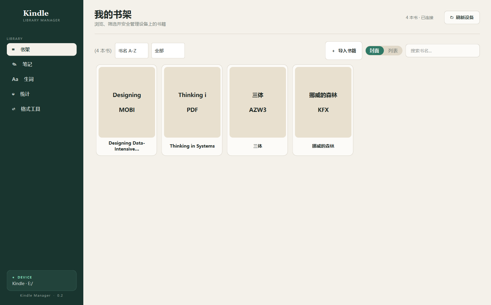

<p align="center">
  
</p>

<h1 align="center">Kindle Manager</h1>

<p align="center">
  一个安静、可靠的 Windows Kindle 桌面管理工具。<br>
  管理书架，整理标注，回顾生词，并把重要数据安全地留在自己手中。
</p>

<p align="center">
  <a href="https://github.com/haver-seed/kindle-manager/releases/latest"></a>
  
  
  <a href="LICENSE"></a>
</p>

<p align="center">
  <a href="https://github.com/haver-seed/kindle-manager/releases/latest/download/KindleManager.exe"><strong>下载 Windows 版</strong></a>
  ·
  <a href="#从源码运行">从源码运行</a>
  ·
  <a href="#数据安全">数据安全</a>
</p>



## 它能做什么

| 功能 | 说明 |
| --- | --- |
| 书架管理 | 封面与列表双视图；支持搜索、格式/来源筛选、排序和批量操作 |
| 安全导入 | 自动适配常见 Kindle `documents` 目录结构，使用临时文件完成可靠复制 |
| 笔记整理 | 解析 `My Clippings.txt`，按书籍浏览并导出 Markdown、CSV 或 JSON |
| 生词回顾 | 读取 Kindle `vocab.db`，按语言过滤，展示来源书籍、语境和查询时间 |
| 阅读概览 | 查看藏书格式分布、空间占用、已打开书籍和阅读位置记录 |
| 格式转换 | 调用 Calibre 转换 EPUB、MOBI、AZW3、PDF 与 TXT |

所有扫描和转换任务都在后台执行，读取大型书库或转换电子书时不会冻结主界面。

## 快速开始

1. 从 [Releases](https://github.com/haver-seed/kindle-manager/releases/latest) 下载 `KindleManager.exe`。
2. 用 USB 将 Kindle 连接到电脑，确认 Windows 中出现包含 `documents` 目录的盘符。
3. 双击启动程序；未自动识别时，点击右上角的“刷新设备”。

程序无需安装，也不会上传书籍、笔记或生词数据。

## 格式说明

- Kindle 书架可识别 KFX、AZW3、AZW、MOBI、PDF、EPUB 和 TXT。
- EPUB 不能通过 USB 直接供 Kindle 阅读，请先转换为 AZW3，或使用 Amazon Send to Kindle。
- 可靠的本地格式转换需要单独安装 [Calibre](https://calibre-ebook.com/download)。
- 本项目不会绕过 DRM，也不会尝试转换受保护的 KFX 文件。

## 数据安全

Kindle Manager 对设备写入采用保守策略：

- 删除书籍时不会立即永久删除，而是移动到 Kindle 根目录下的 `.kindle-manager-trash`。
- 修改 `My Clippings.txt` 前会生成 `My Clippings.txt.bak`。
- 笔记文件使用“临时文件 → 刷盘 → 原子替换”的方式写入。
- 导出文件遇到同名内容时自动生成新文件名，不覆盖已有文件。
- 所有删除目标都会验证必须位于当前 Kindle 根目录内。

如需恢复书籍，将 `.kindle-manager-trash/<时间戳>/` 中的书籍文件和对应 `.sdr` 文件夹移回原目录即可。

## 从源码运行

建议使用独立虚拟环境，避免系统 Python 或 Conda 中的 Qt DLL 相互影响：

```powershell
git clone https://github.com/haver-seed/kindle-manager.git
cd kindle-manager
py -3.13 -m venv .venv
.venv\Scripts\Activate.ps1
python -m pip install -e .
python -m kindle_manager.main
```

安装开发依赖并运行检查：

```powershell
python -m pip install -e ".[dev]"
pytest
ruff check kindle_manager tests
```

## 打包 Windows EXE

```powershell
python -m pip install pyinstaller
pyinstaller KindleManager.spec --noconfirm --clean
powershell -ExecutionPolicy Bypass -File scripts\smoke_test_exe.ps1
```

产物位于 `dist/KindleManager.exe`。请在独立虚拟环境中打包；项目配置会排除可能由 Conda `PATH` 注入的不兼容 ICU DLL。冒烟测试会检查真正的 Kindle Manager 主窗口是否出现，而不是仅判断进程是否存活。

## 项目结构

```text
kindle_manager/
├── core/       # 设备扫描、笔记、生词、导出、转换和安全文件操作
├── models/     # 书籍与笔记数据模型
└── ui/         # PySide6 界面、主题与后台任务
resources/      # 全局样式和应用图标
scripts/        # 构建后验证脚本
tests/          # 核心行为测试
```

## License

[MIT](LICENSE)
